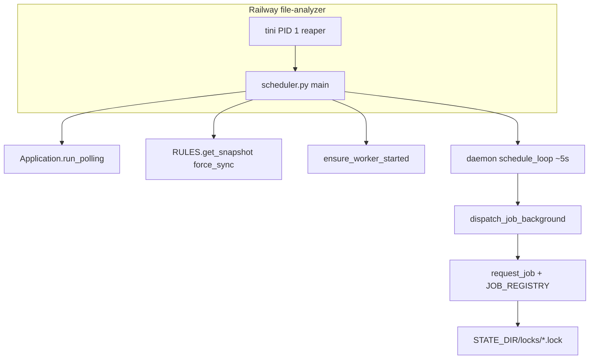

# Project Book

| Мета | Значение |
|------|----------|
| **Документ** | PROJECT_BOOK — discovery v1 |
| **Проект (repo)** | Test / analizis |
| **Дата сборки** | 2026-06-05 |
| **Источники** | `project_memory/*.md`, runtime `.py`, `railway.toml`, `nixpacks.toml`, `Procfile` |
| **Метод** | Только подтверждённые факты из кода/KB; иначе **UNKNOWN** |
| **Ограничение** | Без изменений runtime-кода и env |

---

## Executive Summary

**analizis** — long-running Python-сервис на Railway: единая точка входа `scheduler.py` поднимает Telegram long polling (python-telegram-bot), фоновый цикл расписаний из `rules.xlsx`, и lazy WalletEditor workers. Планировщик триггерит фоновые job-типы через `dispatch_job_background` → `request_job` с PID-lock в `{STATE_DIR}/locks/`.

**Активные job types в коде** (`core/lock_status.py` `KNOWN_JOB_TYPES`): `wallet`, `hourly`, `rate`, `download`, `raccoon_wallet`, `raccoon_hourly`, `raccoon_daily_conversion`.

**Интеграции:** Telegram, Antares (Playwright), Raccoon (Playwright), Bakai (Playwright), Dropbox (rules, входные файлы, state, WE registry).

**Live prod** (uptime, enabled schedule rows, фактические env на Railway): **UNKNOWN** — подтверждена только конфигурация deploy из repo.

---

## Business Purpose

| Поле | Значение | Источник |
|------|----------|----------|
| Название | analizis | `project_memory/architecture_map.md`, `EXPERT_REVIEW.md` |
| Назначение | Автоматизация загрузки данных, аналитических расчётов и доставки результатов в Telegram на управляемых правилах | `PROJECT_REFERENCE.md`, KB |
| Deploy | Railway, service `file-analyzer` | `railway.toml` |
| Run command | `/usr/bin/tini -s -- /opt/venv/bin/python scheduler.py` | `railway.toml` `[deploy].startCommand` |

---

## Architecture

### Production entry & startup



| Шаг | Действие | Модуль |
|-----|----------|--------|
| 1 | Fail-fast без `TELEGRAM_BOT_TOKEN` | `scheduler.py` L268–269 |
| 2 | Register PTB handlers (`get_handlers`) | `integrations/tg_commands.py` |
| 3 | Fail-fast при битых rules | `RULES.get_snapshot(force_sync=True)` L277 |
| 4 | Lazy WalletEditor workers | `automation/worker.ensure_worker_started` |
| 5 | Daemon `schedule_loop` | `scheduler.schedule_loop` L280 |
| 6 | Blocking polling | `app.run_polling` L283 |

### Job dispatch

| Слой | Модуль | Поведение |
|------|--------|-----------|
| Scheduler tick | `scheduler.py` | `load_schedules` → due jobs → `dispatch_job_background` (не ждёт завершения) |
| Dispatch | `core/job_dispatch.py` | `JOB_DISPATCH_VIA_EXECUTOR` (default `1`) → ThreadPoolExecutor |
| Runner | `core/job_runner.py` | PID lock, `_RUNNING`, events, `JOB_REGISTRY[job_type]()` |
| Registry (base) | `integrations/tg_commands.py` L202–208 | `wallet`, `hourly`, `rate`, `download` |
| Registry (Raccoon) | `integrations/raccoon_jobs.py` L27–32 | `raccoon_wallet`, `raccoon_hourly`, `raccoon_daily_conversion` |

### Lock systems (два независимых)

| Lock | Path | TTL / stale | Использование |
|------|------|-------------|---------------|
| Job single-flight | `{STATE_DIR}/locks/{job_type}.lock` | `JOB_LOCK_STALE_SEC` default 600; ghost PID-1 handling | Все scheduled/TG jobs |
| Dropbox analyze | `/tmp/dropbox_pipeline.lock` | 600 sec | `downloader.run_download` analyze phase; `main.process_file` |

### Rules runtime (v2 snapshot)

| Этап | Модуль |
|------|--------|
| Sync workbook | `core/rules_provider.py` — Dropbox `RULES_XLSX_PATH` → `/tmp/rules_cache/rules.xlsx` |
| Bridge | `core/rules_v2/bridge_legacy.py` — legacy Excel sheets → `RulesSnapshotV2` |
| Indexes | `core/rules_v2/indexes.py` `build_indexes` |
| Consumers | `core/schedules.py`, `core/access_rules.py`, `core/config_manager.py`, analyzers accessors |

**Workbook sheets read by bridge (подтверждено в `bridge_legacy.py`):** `meta`, `access`, `commands`, `schedules`, `job_params`, `exclude_time`, `thresholds_partner`, `wallet_limits`, `partner_groups`, `hourly_payins`, `hourly_payouts`, `hourly_payout_methods`, `ui_layout`, optional `telegram_routes`, `payout_info_rules`, `payout_ignore_phrases`, и др.

**Structural REQUIRED sheets (validation catalog):** `meta`, `exclude_time`, `access`, `commands` — `core/rules_v2/contract_schema.py` `REQUIRED_SHEETS`.

---

## Runtime Inventory

Классификация: reachability из `scheduler.py` (import chain + `JOB_REGISTRY`).

### CONFIRMED_ACTIVE (production path)

| Модуль | Назначение | Вызывается из | Вызывает | Ключевые env |
|--------|------------|---------------|----------|--------------|
| `scheduler.py` | Prod entry | Railway start | PTB, schedules, WE workers, job health, TG health log | `TELEGRAM_BOT_TOKEN` |
| `integrations/tg_commands.py` | Commands, JOB_REGISTRY base, hourly wrapper | `scheduler` | `dispatch_job_*`, analyzers, downloaders | `RULES_XLSX_PATH`, `OBSERVATION_ENABLED` |
| `integrations/raccoon_jobs.py` | Raccoon JOB_REGISTRY | import from `tg_commands` | raccoon downloaders + reports | — |
| `core/job_runner.py` | Locks, events, registry dispatch | `job_dispatch` | `JOB_REGISTRY` fn | `STATE_DIR`, `JOB_LOCK_STALE_SEC` |
| `core/job_dispatch.py` | Background/sync dispatch | scheduler, tg_commands | `request_job` | `JOB_DISPATCH_VIA_EXECUTOR`, `JOB_EXECUTOR_MAX_WORKERS` |
| `core/schedules.py` | Schedules from rules | `schedule_loop` | `get_snapshot_v2`, `ScheduleRulesAccessor` | via `RULES_XLSX_PATH` |
| `core/rules_provider.py` | rules.xlsx sync + v2 publish | startup, schedules, access | `dropbox_watcher.download_file` | `RULES_XLSX_PATH`, `RULES_SYNC_MIN_INTERVAL_SEC`, contract flags |
| `core/access_rules.py` | TG access | `tg_commands` | v2 snapshot | `RULES_XLSX_PATH` |
| `core/config_manager.py` | job_params | hourly gate, analyzers | rules snapshot | — |
| `core/state_store.py` / `core/state_provider.py` | Fingerprints, state.json | hourly/wallet wrappers | Dropbox | `RULES_XLSX_PATH`, `STATE_SYNC_MIN_INTERVAL_SEC` |
| `core/event_log.py` | JSONL events | job_runner, pipelines | filesystem | `STATE_DIR` |
| `core/job_health.py` | Observe-only health | scheduler, `/status` | `job_progress`, locks | `JOB_HEALTH_*` |
| `core/lock_status.py` | Lock inspection | `/status` | filesystem | `STATE_DIR` |
| `integrations/downloader.py` | Job `download` | JOB_REGISTRY | Playwright, Dropbox, `run_conversion_pipeline`, `process_file` | `ANTARES_*`, `TELEGRAM_CHAT_ID_ANALIZ`, `DROPBOX_INPUT_PATH`, `PLAYWRIGHT_HEADLESS` |
| `integrations/downloader_wallets.py` | Job `wallet` | JOB_REGISTRY | Playwright, wallet analyzer, TG routes | `ANTARES_*`, `TELEGRAM_CHAT_ID_WALLET` / routes flag |
| `integrations/hourly_downloader.py` | Antares DL for hourly | `hourly_report` | Playwright | `ANTARES_*` |
| `integrations/bakai_monitor_playwright.py` | Job `rate` | JOB_REGISTRY | Playwright, TG routes | Bakai chat envs / routes flag |
| `integrations/conversion_pipeline.py` | Conversion lifecycle | `downloader`, `main` | `conversion.run`, fingerprint, move | `DROPBOX_*`, `CONVERSION_FINGERPRINT_ENABLED` |
| `integrations/conversion_wallet_editor_bridge.py` | Conversion→WE hook | `analyzers/conversion.py` | `add_task`, TG routes | `CONVERSION_WALLET_EDITOR*`, routes flag |
| `integrations/dropbox_watcher.py` | Dropbox IO | rules, pipelines, registry | dropbox API | `DROPBOX_ACCESS_TOKEN` or refresh trio |
| `integrations/telegram_bot.py` | Outbound queue + health | jobs, WE worker | Telegram API | `TELEGRAM_BOT_TOKEN`, `TELEGRAM_HEALTH_*` |
| `integrations/telegram_routes.py` | Rules V2 route send (Phases 3A–3D) | hourly, wallet, WE bridge, Bakai | `get_snapshot_v2` | `TELEGRAM_ROUTES_FROM_RULES_V2` |
| `integrations/wallet_editor_tg.py` | WE document ingest | PTB MessageHandler | `add_task` | `WALLET_EDITOR_ALLOWED_CHAT_IDS`, operator map |
| `automation/worker.py` | Per-profile queue/worker | scheduler, bridge, WE tg | `engine.run`, TG, registry async | per-task credentials |
| `automation/engine.py` | Antares UI card editing | worker | Playwright | per-profile `auth_state_path` |
| `automation/runtime.py` | Operator map, task model | wallet_editor_tg, bridge | env credential resolution | `WALLET_EDITOR_OPERATOR_*` |
| `integrations/wallet_editor_registry*.py` | Dropbox cumulative registry | worker (async) | openpyxl, Dropbox rev | `DROPBOX_WALLET_EDITOR_PATH`, `STATE_DIR` |
| `integrations/raccoon_wallet_downloader.py` | Raccoon PayIn DL | `raccoon_wallet` job | analyzer | `RACCOON_LOGIN`, `RACCOON_PASSWORD`, `TELEGRAM_CHAT_ID_RACCOON_WALLET` |
| `integrations/raccoon_hourly_downloader.py` | Raccoon hourly DL | `raccoon_hourly` job | hourly report | `RACCOON_*` |
| `analyzers/raccoon_hourly_report.py` | 10-min PayIn report + conversion alerts | `raccoon_hourly` job | `send_message_sync` | `TELEGRAM_CHAT_ID_HOURLY_RACCOON`, `TELEGRAM_CHAT_ID_RACCOON_WALLET` |
| `analyzers/raccoon_daily_conversion.py` | Daily conversion summary | `raccoon_daily_conversion` job | `send_message_sync` | `TELEGRAM_CHAT_ID_RACCOON_WALLET` |
| `analyzers/raccoon_wallet_analyzer.py` | Raccoon wallet report | wallet downloader | rules v2 config | `TELEGRAM_CHAT_ID_RACCOON_WALLET`, `RULES_XLSX_PATH` |
| `main.py` | `process_file()` library/CLI | downloader, CLI | selector, payout, conversion pipeline | `DROPBOX_*`, `TELEGRAM_CHAT_ID_ANALIZ` |
| `run_once_guard.py` | Pipeline lock | downloader, main | `/tmp/dropbox_pipeline.lock` | — |
| `observability/conversion_fp_observation.py` | FP diagnostic JSONL | conversion_pipeline | filesystem | `CONVERSION_FP_OBSERVATION_ENABLED`, `STATE_DIR` |

### LEGACY (не production)

| Модуль | Риск |
|--------|------|
| `automation/main.py` | Standalone WE entry — не параллелить со `scheduler.py` |
| `automation/tg_receiver.py` | Raw `getUpdates` — второй polling loop |

### DORMANT

| Модуль | Причина |
|--------|---------|
| `analyzers/transactions.py` | Нет imports из active chain; stale `analysis_map.yaml` ref |

### DEV_ONLY entrypoints (`if __name__ == "__main__"`)

`main.py`, `integrations/downloader.py`, `integrations/downloader_wallets.py`, `integrations/bakai_monitor_playwright.py`, `integrations/hourly_downloader.py`, `integrations/raccoon_wallet_downloader.py`, `scheduler.py`, `tools/validate_rules_xlsx.py`, `scripts/*`, `automation/main.py`.

---

## Pipelines

### P1 — Hourly (Platform Antares)

| Поле | Значение |
|------|----------|
| **Назначение** | Intraday/final hourly payin/payout отчёт в Telegram |
| **Источник** | Antares xlsx → `/tmp/hourly/payin.xlsx`, `payout.xlsx` |
| **Trigger** | `schedules` row `job_type=hourly` + gate `job_params`: `intraday_interval_minutes`, `final_daily_time` |
| **Entry** | `run_hourly_job` → `analyzers/hourly_report.run_hourly_report` → send via `send_message_to_route("platform_hourly_report")` |
| **Зависимости** | `ANTARES_*`, rules, `state_store` fingerprint |
| **Результат** | TG hourly chat; `state.jobs.hourly.last_fingerprint` on successful send |
| **Skip** | Unchanged fingerprint → skip send (events inside hourly_report) |

### P2 — Wallet (Platform Antares)

| Поле | Значение |
|------|----------|
| **Назначение** | Wallet payin/payout аналитика |
| **Источник** | Playwright → `/tmp/wallet_handler/*` |
| **Trigger** | schedule `wallet` или `/run_wallet` |
| **Entry** | `integrations/downloader_wallets.run_wallet_cycle` |
| **Зависимости** | rules job_params, `state_store`, TG route or `TELEGRAM_CHAT_ID_WALLET` |
| **Результат** | TG wallet report; state fingerprint |
| **Failure** | Empty report → `RuntimeError`; missing chat → skip send + warning |

### P3 — Antares download + Conversion + Payout

| Поле | Значение |
|------|----------|
| **Назначение** | Скачать card/conversion/cd/payout с Antares → Dropbox → analyze |
| **Trigger** | schedule `download` или `/run_download` |
| **Entry** | `integrations/downloader.run_download` |
| **Runtime path** | Playwright DL → upload Dropbox → `acquire_lock` → `run_conversion_pipeline` → optional `process_file` payout → `release_lock` → tiered final TG |
| **Зависимости** | `ANTARES_*`, `DROPBOX_INPUT_PATH`, `TELEGRAM_CHAT_ID_ANALIZ`, pipeline lock |
| **Результат** | Conversion/payout reports + TG; files in processed |
| **Conversion sub-path** | `run_conversion_pipeline` → passive fingerprint → `conversion.run` → events/state |

### P4 — Bakai rate

| Поле | Значение |
|------|----------|
| **Назначение** | Мониторинг курса покупки RUB на bakai.kg |
| **Trigger** | schedule `rate` или `/run_rate` |
| **Entry** | `run_rate_monitor_safe` → `check_bakai_rate` |
| **Окно** | 08:00–23:55 MSK (`_in_time_window`) |
| **Retries** | 3 attempts, delays 5/15/30s |
| **Результат** | TG: `bakai_rate_current` / `bakai_rate_alert` (routes flag) или legacy env chats |
| **State** | `/tmp/bakai_last_buy_rate.txt` |

### P5 — Dropbox file analyze (library)

| Поле | Значение |
|------|----------|
| **Назначение** | Analyze file already in Dropbox input |
| **Trigger** | P3 payout branch или CLI `python main.py <file>` |
| **Entry** | `main.process_file` → `selector` constants |
| **Conversion** | Delegates to `run_conversion_pipeline` |
| **Payout** | `analyzers/payout.py` |

### P6 — Dropbox Sync (control plane data)

| Поле | Значение |
|------|----------|
| **Назначение** | Синхронизация rules и shared state с Dropbox |
| **rules.xlsx** | `core/rules_provider.get_rules_snapshot` — throttle `RULES_SYNC_MIN_INTERVAL_SEC` (30s); cache `/tmp/rules_cache/rules.xlsx` |
| **state.json** | `core/state_provider` — `{rules_folder}/state/state.json` → `/tmp/state_cache/state.json`; fail-safe cached local |
| **File pipeline** | `dropbox_watcher` download/upload/move для analyze paths |
| **Trigger** | On-demand (`force_sync`), job wrappers, `/reload_rules` |
| **Scheduler** | Нет отдельного job type `dropbox_sync` в `KNOWN_JOB_TYPES` |

### P-RW — Raccoon Wallet

| Поле | Значение |
|------|----------|
| **Назначение** | Raccoon PayIn monitor + wallet-style report |
| **Источник** | Playwright `raccoon.it.com` → `/tmp/raccoon_wallet/payin_*.xlsx` |
| **Config** | Rules V2 only — `resolve_raccoon_wallet_config()` |
| **Trigger** | schedule `raccoon_wallet` или `/run_raccoon` |
| **Entry** | `run_raccoon_wallet_job` → `run_raccoon_wallet_cycle` → `analyze_raccoon_wallets` |
| **Результат** | TG `TELEGRAM_CHAT_ID_RACCOON_WALLET` (или `TELEGRAM_CHAT_ID` fallback в downloader error path) |

### P-RH — Raccoon Hourly

| Поле | Значение |
|------|----------|
| **Назначение** | 10-min PayIn by-method report + conversion drop alerts |
| **Источник** | `/tmp/hourly_raccoon/payin.xlsx` (downloader) |
| **Trigger** | schedule `raccoon_hourly` или `/run_hourly_raccoon` |
| **Entry** | `run_raccoon_hourly_job`: `run_hourly_raccoon_cycle` → `run_hourly_report` (raccoon_hourly_report) |
| **TG** | PayIn report → `TELEGRAM_CHAT_ID_HOURLY_RACCOON`; conversion alerts → `TELEGRAM_CHAT_ID_RACCOON_WALLET` |
| **Примечание** | Не использует `send_message_to_route` (подтверждено тестами phase3) |

### P-RD — Raccoon Daily Conversion

| Поле | Значение |
|------|----------|
| **Назначение** | Суточный conversion-отчёт по вчерашнему дню из PayIn |
| **Источник** | `/tmp/hourly_raccoon/payin.xlsx` (тот же файл, что hourly Raccoon) |
| **Trigger** | schedule `raccoon_daily_conversion` (нет TG-команды в help) |
| **Entry** | `run_raccoon_daily_conversion_job` → `run_daily_conversion_report` |
| **Результат** | TG `TELEGRAM_CHAT_ID_RACCOON_WALLET` |

### P-WE — WalletEditor

См. отдельную главу **WalletEditor**.

### P-CONV-WE — Conversion → Wallet Editor hook

| Поле | Значение |
|------|----------|
| **Назначение** | Best-effort: `problem_cards` → Excel → WE queue |
| **Trigger** | После `analyzers/conversion.py` `run()` |
| **Entry** | `integrations/conversion_wallet_editor_bridge.py` |
| **Profile** | `CONVERSION_AUTO`; credentials `CONVERSION_WALLET_EDITOR_OPERATOR_PROFILE_*` |
| **Ограничение** | Never raises; missing env → skip |

### P-TG — Telegram Commands (control plane)

| Поле | Значение |
|------|----------|
| **Назначение** | Manual jobs, rules reload, status, access, WE ingest |
| **Entry** | `scheduler` → `get_handlers()` |
| **Access** | `rules.xlsx` sheets `access`, `commands` via `AccessRules` |
| **Job dispatch** | `dispatch_job_async` (blocking wait vs background scheduler) |

---

## Scheduler

### schedule_loop

| Параметр | Значение |
|----------|----------|
| Интервал tick | `time.sleep(5)` (~5s) |
| Источник расписаний | `load_schedules(force_sync=False)` каждый tick |
| Load failure | sleep 10s, `record_error` |
| Hourly gate | `get_job_params(job="hourly")` — intraday bucket + final daily time |
| Inactive jobs | Removed from `next_every` / `next_cron` when absent from active schedules |
| Side effects per tick | `record_tick`, `evaluate_job_health_if_due`, `log_telegram_health_if_due` |
| Job fire | `dispatch_job_background(job_type, Actor(scheduler))` — exceptions logged, loop continues |

### Cron support

Формат: `"M H * * *"` — minute explicit; hour `*` = every hour at :M (`scheduler.py` `_parse_cron_min_hour`).

### Scheduler Map (job types)

| job | Частота (источник) | Точка входа | Побочные эффекты |
|-----|-------------------|-------------|------------------|
| `wallet` | `schedules` row | `run_wallet_cycle` | Antares DL, progress stages, TG, state, lock |
| `hourly` | schedules + **job_params gate** | `run_hourly_job` | Antares DL, TG route, state fp |
| `download` | schedules | `run_download` | Antares DL, Dropbox upload, conversion+payout analyze, pipeline lock, TG analiz |
| `rate` | schedules | `run_rate_monitor_safe` | Bakai scrape, rate file, TG (2 routes) |
| `raccoon_wallet` | schedules | `run_raccoon_wallet_cycle` | Raccoon DL, analyzer, TG |
| `raccoon_hourly` | schedules | `run_hourly_raccoon_cycle` + hourly report | Raccoon DL, 2 TG chats |
| `raccoon_daily_conversion` | schedules | `run_daily_conversion_report` | Read payin xlsx, TG wallet chat |
| `schedule_loop` | ~5s | `scheduler.schedule_loop` | dispatch due jobs, health, TG health log |

**Prod schedule rows (enabled cron/interval per job):** **UNKNOWN** (зависит от live `rules.xlsx`).

---

## Telegram

### Commands (подтверждено `tg_commands._help_text` + handlers)

| Команда | Guard command | Действие |
|---------|---------------|----------|
| `/start` | `start` | Приветствие + help |
| `/help` | `help` | Список команд |
| `/status` | `status` | Running jobs; с `OBSERVATION_ENABLED=1` — расширенный observability block |
| `/whoami` | `whoami` | chat_id, user_id, access level |
| `/reload_rules` | `reload_rules` | Invalidate + sync rules; `request_scheduler_clocks_reset` |
| `/run_wallet` | `run_wallet` | `dispatch_job_async("wallet")` |
| `/run_hourly` | `run_hourly` | `dispatch_job_async("hourly")` |
| `/run_download` | `run_download` | `dispatch_job_async("download")` |
| `/run_rate` | `run_rate` | `dispatch_job_async("rate")` |
| `/run_raccoon` | `run_raccoon` | `dispatch_job_async("raccoon_wallet")` |
| `/run_hourly_raccoon` | `run_hourly_raccoon` | `dispatch_job_async("raccoon_hourly")` |
| *(нет команды)* | — | `raccoon_daily_conversion` — только scheduler |

### Non-command handlers

| Handler | Filter | Entry |
|---------|--------|-------|
| `handle_wallet_editor_document` | `filters.Document.ALL` | WalletEditor `.xlsx` ingest |

### Router paths (`telegram_routes`)

**Flag:** `TELEGRAM_ROUTES_FROM_RULES_V2` (default `0`).

**Migrated runtime routes** (when flag `1`): `platform_hourly_report`, `platform_wallet_download_report`, `conversion_wallet_editor`, `bakai_rate_current`, `bakai_rate_alert`.

**Allowed route keys** (sheet + validator): см. `core/rules_v2/constants.py` `ALLOWED_TELEGRAM_ROUTE_KEYS` — включает analiz_*, raccoon_*, platform_*, conversion_*, bakai_*, `wallet_editor_registry_warnings`.

**Shadow compare:** ENV ↔ rules every 300s when sheet present; `/status` fields via `format_telegram_routes_status_lines`.

### Chat ID env (delivery)

| ENV | Route key(s) | Primary consumer |
|-----|--------------|------------------|
| `TELEGRAM_CHAT_ID_ANALIZ` | analiz_* (4 keys) | `downloader.py`, `main.py`, `payout.py`, `conversion.py` |
| `TELEGRAM_CHAT_ID_HOURLY` | `platform_hourly_report` | legacy hourly; migrated when flag=1 |
| `TELEGRAM_CHAT_ID_WALLET` | `platform_wallet_download_report` | `downloader_wallets` legacy |
| `TELEGRAM_CHAT_ID_HOURLY_RACCOON` | `raccoon_hourly_payin_report` | `raccoon_hourly_report` |
| `TELEGRAM_CHAT_ID_RACCOON_WALLET` | raccoon_hourly_conversion_alert, raccoon_wallet_report, raccoon_daily_conversion_report, raccoon_wallet_downloader_error | Raccoon analyzers/downloader |
| `CONVERSION_WALLET_EDITOR` | `conversion_wallet_editor` | WE bridge + worker reply chat |
| `CURRENT_RATE_BAKAI_CHAT_ID` | `bakai_rate_current` | Bakai unchanged/errors/screenshot |
| `NEW_RATE_BAKAI_CHAT_ID` | `bakai_rate_alert` | Bakai rate change |
| `TELEGRAM_CHAT_ID_EMERGENCY` | — | Reserved; not business fallback |
| `WALLET_EDITOR_ALLOWED_CHAT_IDS` | — | Ingest allowlist only (not delivery route sheet) |

**Not env-routed:** Raccoon hourly/daily send via `send_message_sync` directly.

### Integrations summary

| Integration | Inbound | Outbound |
|-------------|---------|----------|
| PTB polling | Commands + documents | `telegram_bot` queue (`send_message_sync`, `send_text`, `send_document`) |
| WalletEditor ingest | `.xlsx` in allowed chats | Per-task `task.chat_id` |
| Conversion notifications | — | bridge → route or `CONVERSION_WALLET_EDITOR` |
| Bakai | — | route helpers or legacy env |

---

## WalletEditor

### Production chain

```
Telegram .xlsx (allowed chat + mapped user_id)
    → integrations/wallet_editor_tg.handle_wallet_editor_document
    → resolve_operator_for_user (WALLET_EDITOR_OPERATOR_MAP + per-profile LOGIN/PASSWORD)
    → WalletEditorTask → automation/worker.add_task (per operator_profile queue)
    → daemon worker_loop (sequential per profile)
    → automation/engine.run (Playwright → Antares UI)
    → transport.telegram_transport send_text + send_document (task.chat_id)
    → wallet_editor_registry_async (best-effort Dropbox append AFTER TG)
```

### Точки отказа

| # | Условие | Поведение |
|---|---------|-----------|
| 1 | Пустой `WALLET_EDITOR_ALLOWED_CHAT_IDS` | Все чаты отклонены (fail-closed) |
| 2 | Chat не в allowlist | Reply «Чат не разрешён»; `get_file` не вызывается |
| 3 | Не `.xlsx` | Отказ |
| 4 | Unmapped `telegram_user_id` | `MSG_OPERATOR_UNMAPPED` |
| 5 | Incomplete profile credentials | `MSG_OPERATOR_INCOMPLETE` |
| 6 | `engine.run` exception | TG error text; queue continues |
| 7 | Telegram sender degraded | Delivery may fail; health logs (`R-TG-02` in tasks.md) |
| 8 | Railway restart | `/tmp` auth-state lost → re-login per profile |
| 9 | Parallel profiles | OOM/thread pressure (`R-WE-01`, `R-WE-02`) |
| 10 | Registry Dropbox conflict | Rev mismatch → retry until timeout; per-run TG not blocked |
| 11 | Legacy `automation/main.py` / `tg_receiver.py` | Double polling if started — **не использовать** |

### Env (WalletEditor)

| Variable | Обязателен | Назначение |
|----------|------------|------------|
| `WALLET_EDITOR_ALLOWED_CHAT_IDS` | да (для ingest) | Comma-separated chat ids |
| `WALLET_EDITOR_OPERATOR_MAP` | да | `user_id:PROFILE` pairs |
| `WALLET_EDITOR_OPERATOR_<PROFILE>_LOGIN` | да per profile | Antares login |
| `WALLET_EDITOR_OPERATOR_<PROFILE>_PASSWORD` | да per profile | Antares password |
| `DROPBOX_WALLET_EDITOR_PATH` | нет | Registry workbook; skip if unset |
| `WALLET_EDITOR_AUTH_STATE_PATH` | нет | Default auth path (legacy); production uses `/tmp/auth_state_wallet_editor_<PROFILE>.json` |
| `WALLET_EDITOR_ANTARES_LOGIN/PASSWORD` | нет | **Не** используются production handler (WE-5) |

**Conversion hook env:** `CONVERSION_WALLET_EDITOR`, `CONVERSION_WALLET_EDITOR_OPERATOR_PROFILE_LOGIN/PASSWORD` — profile `CONVERSION_AUTO`, auth `/tmp/auth_state_wallet_editor_CONVERSION_AUTO.json`.

### Ограничения

- Один PTB polling loop (`scheduler.py`).
- Sequential tasks per `operator_profile`; parallel across profiles.
- Registry append async after Telegram; `registry_*_seconds` from rules `job_params` job `wallet_editor`.
- Result naming: `wallet_editor_result_<INPUT>_<PROFILE>.xlsx` with collision suffix.

---

## Conversion

| Layer | Module |
|-------|--------|
| Orchestrator | `integrations/conversion_pipeline.py` |
| Fingerprint | `integrations/conversion_fingerprint.py` (passive Phase 1A) |
| Observation | `observability/conversion_fp_observation.py` (Phase 1B diagnostic, default off) |
| Facade | `analyzers/conversion.py` |
| Analyzer | `analyzers/conversion_analyzer.py` |
| Reporter | `reporters/conversion_reporter.py` |
| Rules | `ConversionRulesAccessor` |
| Routing | `analyzers/selector.py` code constants (no YAML) |

**Fingerprint inputs:** SHA256(conversion file) + card file + rules snapshot fp + special_cards.

**Dedup skip:** NOT implemented (Phase 1B planned — `CONV-OPTIMIZATION-PHASE-1B` in tasks.md).

**Flags:** `CONVERSION_FINGERPRINT_ENABLED` (default on), `CONVERSION_FP_OBSERVATION_ENABLED` (default off).

---

## Rules System

### Source of truth

| Артефакт | Path | Sync |
|----------|------|------|
| Production workbook | Dropbox via `RULES_XLSX_PATH` | → `/tmp/rules_cache/rules.xlsx` |
| Local override | If `RULES_XLSX_PATH` points to local `.xlsx` file | No Dropbox |

### Lifecycle

1. `get_rules_snapshot` / `get_snapshot_v2` download or read local workbook.
2. `build_snapshot_v2_from_legacy` — pandas sheets → typed `RulesSnapshotV2`.
3. `evaluate_snapshot_publish` — contract strict/shadow/identity policies.
4. `build_indexes` — runtime indexes for accessors.
5. Consumers: schedules, access, job_params, analyzers, telegram_routes.
6. `/reload_rules` → invalidate caches + scheduler clock reset.

### Snapshot v2 model

Defined in `core/rules_v2/models.py` — includes `schedule_rules`, `job_params`, `access_rules`, `telegram_routes`, `threshold_rules`, `limit_rules`, `exclusion_rules`, report model entities, etc.

### Indexes

`core/rules_v2/indexes.py` — e.g. `schedule_rules_by_job`, `job_params_index`, `group_members_by_job`.

### Accessors

`core/rules_v2/accessors.py` — `ScheduleRulesAccessor`, `AccessRulesAccessor`, `ConversionRulesAccessor`, Raccoon accessors, payout accessors.

### Validation / audit

| Tool | Path |
|------|------|
| Workbook schema catalog | `core/rules_v2/contract_schema.py` |
| CLI validator | `tools/validate_rules_xlsx.py` |
| TG `/rules_validate` | `build_rules_validate_telegram_chunks_with_payload` |
| Audit JSONL | `RULES_VALIDATE_AUDIT_JSONL` optional |

### CLI tools (non-runtime)

`tools/validate_rules_xlsx.py`, `scripts/extract_legacy_identities.py`, `scripts/smoke_wallet_editor_registry_lifecycle.py`.

---

## Environment Variables

Полная таблица — см. `project_memory/contracts.md` §1. Ниже — сводка по runtime-критичности.

| ENV | Назначение | Обязателен? | Кто использует | Runtime без него |
|-----|------------|-------------|----------------|------------------|
| `TELEGRAM_BOT_TOKEN` | Bot API | да (prod) | `scheduler.py`, `telegram_bot.py` | Process exit at start |
| `RULES_XLSX_PATH` | Dropbox folder or local rules path | да | rules_provider, access, state paths | Startup/sync fail |
| `STATE_DIR` | Persistent state | нет (default `/data/state`) | locks, events, observation, WE registry state | Defaults; Railway volume expected |
| `ANTARES_LOGIN` / `ANTARES_PASSWORD` | Antares Playwright | да для download jobs | downloader*, hourly_downloader | Job RuntimeError |
| `RACCOON_LOGIN` / `RACCOON_PASSWORD` | Raccoon Playwright | да для Raccoon jobs | raccoon_*_downloader | Job RuntimeError |
| `DROPBOX_INPUT_PATH` | Input folder | да для P3/P5 | main, downloader, conversion_pipeline | Analyze/upload fail |
| `DROPBOX_PROCESSED_PATH` | Processed folder | да for moves | main, payout, pipeline | Move fail |
| `DROPBOX_ACCESS_TOKEN` **or** refresh trio | Dropbox API | да* | dropbox_watcher | All Dropbox IO fail |
| `TELEGRAM_CHAT_ID_ANALIZ` | Analiz notifications | да (import) | downloader, main, payout, conversion | ImportError / notify fail |
| `TELEGRAM_CHAT_ID_HOURLY` | Hourly (legacy) | да if flag=0 and send needed | hourly wrapper legacy path | Skip send if routes missing |
| `TELEGRAM_CHAT_ID_WALLET` | Wallet (legacy) | нет | downloader_wallets | Skip send if empty |
| `TELEGRAM_CHAT_ID_HOURLY_RACCOON` | Raccoon hourly report | да for raccoon hourly | raccoon_hourly_report | RuntimeError |
| `TELEGRAM_CHAT_ID_RACCOON_WALLET` | Raccoon wallet/daily/alerts | да for those jobs | raccoon analyzers | RuntimeError |
| `CURRENT_RATE_BAKAI_CHAT_ID` / `NEW_RATE_BAKAI_CHAT_ID` | Bakai (legacy) | нет | bakai_monitor | Skip send with warning |
| `TELEGRAM_ROUTES_FROM_RULES_V2` | Rules-based delivery | нет (0) | telegram_routes, hourly, wallet, WE bridge, Bakai | Legacy ENV paths |
| `WALLET_EDITOR_ALLOWED_CHAT_IDS` | WE ingest | да for ingest | wallet_editor_tg | All ingest denied if empty |
| `WALLET_EDITOR_OPERATOR_MAP` + per-profile `_*_LOGIN/PASSWORD` | WE credentials | да for ingest | runtime, wallet_editor_tg | Ingest denied |
| `DROPBOX_WALLET_EDITOR_PATH` | WE registry | нет | wallet_editor_registry | Registry skipped |
| `CONVERSION_WALLET_EDITOR*` | Scheduled WE hook | нет | conversion_wallet_editor_bridge | Hook skipped |
| `CONVERSION_FINGERPRINT_ENABLED` | Passive FP | нет (on) | conversion_pipeline | FP disabled |
| `CONVERSION_FP_OBSERVATION_ENABLED` | Diagnostic JSONL | нет (off) | observation module | No JSONL |
| `PAYOUT_CONFIG_FROM_RULES_V2` | Payout rules source | нет (prod=1 per KB) | payout_config_loader | YAML primary if 0 |
| `JOB_HEALTH_GUARD_ENABLED` | /status job_health | нет (0) | job_health, scheduler | Block omitted |
| `JOB_DISPATCH_VIA_EXECUTOR` | Background jobs | нет (1) | job_dispatch | Inline dispatch |
| `PLAYWRIGHT_HEADLESS` | Browser mode | нет (1) | Playwright modules | Headless default |
| `OBSERVATION_ENABLED` | Extended /status | нет | tg_commands | Short status only |

\* Dropbox: `DROPBOX_ACCESS_TOKEN` **или** `DROPBOX_REFRESH_TOKEN` + `DROPBOX_APP_KEY` + `DROPBOX_APP_SECRET`.

**Полный inventory + file contracts:** `project_memory/contracts.md`.

---

## Railway Deployment

| Поле | Значение | Источник |
|------|----------|----------|
| Builder | NIXPACKS | `railway.toml` |
| Service name | `file-analyzer` | `railway.toml` |
| Start command | `/usr/bin/tini -s -- /opt/venv/bin/python scheduler.py` | `railway.toml` `[deploy].startCommand` |
| Init reaper | `tini` (`-s` subreaper) via apt in `nixpacks.toml` | E-INFRA-02 |
| Plan | `free` | `railway.toml` |
| Python venv | `/opt/venv` | `nixpacks.toml` |
| Playwright | `playwright install chromium` in install phase | `nixpacks.toml` |
| System deps | Chromium/NSS/GTK libs in `aptPkgs` | `nixpacks.toml`, `Procfile` postinstall |
| Postinstall | Duplicate Chromium deps via apt in `Procfile` | `Procfile` |

### Build model

1. Nixpacks setup: apt packages + tzdata.
2. venv + `pip install -r requirements.txt`.
3. Playwright Chromium install.

### Deploy model

`tini` as PID 1 (zombie reaper for Chromium children) → `scheduler.py` as child: Telegram polling + daemon scheduler thread + lazy WE worker threads.

**Note:** `[services.main].start` in `railway.toml` is **ignored** by Railway; effective start is `[deploy].startCommand` only (see INC-2026-06-05).

### State storage

| Data | Location | Persistent across restart? |
|------|----------|----------------------------|
| Locks, events, WE registry idempotency, observation JSONL | `STATE_DIR` (default `/data/state`) | **Да** if Railway Volume mounted — **UNKNOWN** in repo config |
| Playwright auth, downloads, `/tmp` caches | `/tmp/*` | **Нет** on container restart |
| Rules cache | `/tmp/rules_cache/rules.xlsx` | Re-sync from Dropbox |
| Bakai last rate | `/tmp/bakai_last_buy_rate.txt` | **Нет** |

**Volumes in railway.toml:** **UNKNOWN** — not declared in repo; E-INFRA-01 documents intended `/data/state` volume.

### Observability (platform)

| Signal | Where |
|--------|-------|
| App logs | Railway log stream |
| `[TelegramSender/health]` | `scheduler.schedule_loop` → `telegram_bot.log_telegram_health_if_due` |
| `[ProcessResource/health]` | `scheduler.schedule_loop` → `observability/process_resource_health.log_process_resource_health_if_due` (default 600s; CRITICAL on thresholds) |
| Event log | `{STATE_DIR}/events/events_YYYY-MM-DD.jsonl` |
| `/status` with `OBSERVATION_ENABLED` | Scheduler, locks, conversion, job_health, telegram_routes |

### Restart behavior

| Topic | Status |
|-------|--------|
| Railway crash restart policy | **UNKNOWN** (E8) |
| Process on job error in scheduler | Continues (E7) |
| Stale job locks after redeploy | Reclaim via dead PID / ghost PID-1 / age (`job_runner`) |
| `/tmp` auth states | Lost → re-login |

---

## Observability

| Mechanism | Scope | Persistence |
|-----------|-------|-------------|
| `core/event_log.py` | `job_*`, `conversion_*`, `rules_changed_during_job`, `job_health_degraded` | Daily JSONL under `STATE_DIR/events/` |
| `state_store` / `state_provider` | hourly/wallet/conversion fingerprints | Dropbox `state.json` + local cache |
| `core/scheduler_health.py` | tick age, schedule count, last error | In-memory |
| `integrations/telegram_bot.py` | enqueue vs delivery counters | In-memory |
| `core/job_health.py` | C1 observe-only states | In-memory progress |
| `observability/conversion_fp_observation.py` | FP diagnostic | JSONL 14-day retention |
| `observability/process_resource_health.py` | process/thread/zombie chrome snapshot | Periodic log; CRITICAL thresholds (INC-2026-06-05) |
| `/status` + `OBSERVATION_ENABLED` | Aggregated ops view | — |

---

## Production Incidents

### INC-2026-06-05 — WalletEditor → `RuntimeError: can't start new thread`

| Field | Value |
|-------|-------|
| **ID** | INC-2026-06-05 |
| **Severity** | Production outage (WalletEditor + Playwright jobs degraded) |
| **Status** | **Resolved** |
| **Commits** | `affc689` `fix(runtime): reap playwright chrome zombies`; `5e31560` `fix(deploy): use railway startCommand for tini reaper` |

#### Symptoms

- WalletEditor stopped processing `.xlsx` files.
- Telegram: `❌ Ошибка: can't start new thread`.
- `RuntimeError` in `automation/worker.py` `worker_loop`.
- Rising process/thread count; accumulation of `[chrome-headless] <defunct>` zombies.

#### Investigation facts

| Metric | Before fix (~56 min uptime) | After fix (~2 h uptime) |
|--------|----------------------------|-------------------------|
| PID 1 | `python scheduler.py` | `tini` |
| `ps -eLf \| wc -l` | 959 | 61 |
| Zombie `chrome-headless` | 52 | 0 |

`tini` binary present at `/usr/bin/tini`; manual `tini -s -- python -c "..."` worked — failure was **wrong Railway config section**, not missing package.

#### Root cause

1. Container ran **without init/reaper**: PID 1 was `python scheduler.py` (does not reap orphaned Chromium children).
2. Playwright/Chromium jobs spawn multi-process trees; exited children became **zombies (state Z)**.
3. Zombies consume kernel process/thread table slots → gradual resource exhaustion.
4. New Playwright/WalletEditor runs fail with `RuntimeError: can't start new thread`.
5. Contributing factor: incomplete Playwright stack cleanup on exception paths (fixed in `affc689`, but reaper is the primary fix).

#### Remediation (no business-logic changes)

| Layer | Change | Module / config |
|-------|--------|-----------------|
| A | `tini` as PID 1 (`-s` subreaper) | `nixpacks.toml` apt; `railway.toml` `[deploy].startCommand` |
| B | `close_playwright_stack` in `finally` on all Playwright callers | `core/playwright_cleanup.py`; engine + downloaders + bakai |
| C | Process resource health logging | `observability/process_resource_health.py`; `scheduler.py` |

**Explicit decision:** E-INFRA-02 (see `project-os/project_memory/decisions.md`).

#### Playwright launch sites (all sync `sync_playwright()` — no async mismatch)

`automation/engine.py`, `integrations/downloader_wallets.py`, `integrations/downloader.py`, `integrations/hourly_downloader.py`, `integrations/raccoon_wallet_downloader.py`, `integrations/raccoon_hourly_downloader.py`, `integrations/bakai_monitor_playwright.py`.

Daemon threads (`schedule_registry_append`, `delayed_cleanup`, per-profile WE workers) are bounded per task/profile — **not** primary zombie source.

#### Как диагностировать

```bash
ps -p 1 -o pid,ppid,stat,comm,args
ps aux | grep '[c]hrome-headless' | grep defunct | wc -l
ps -eLf | wc -l
```

| Signal | Healthy | Degraded |
|--------|---------|----------|
| PID 1 | `tini` | `python` |
| Zombie chrome | 0–5 | &gt; 20 |
| Threads/processes (`ps -eLf`) | &lt; 200 | &gt; 800 |
| User-visible | — | `RuntimeError: can't start new thread` |

Env thresholds (optional): `ZOMBIE_CHROME_CRITICAL_THRESHOLD`, `THREAD_COUNT_CRITICAL_THRESHOLD`, `PROCESS_COUNT_CRITICAL_THRESHOLD`, `PROCESS_RESOURCE_HEALTH_LOG_INTERVAL_SECONDS`.

**Post-deploy verification:** send `.xlsx` to WalletEditor; confirm zombie count does not grow into hundreds over 1–2 hours.

---

## Operations Guide

### Если не работает — что проверять

| Симптом | Проверки |
|---------|----------|
| Process не стартует | Railway env: `TELEGRAM_BOT_TOKEN`, `RULES_XLSX_PATH`; startup logs rules sync |
| Нет scheduled jobs | `/status` scheduler tick; rules `schedules` enabled rows (**prod rows UNKNOWN**); `/reload_rules` |
| Job «висит» | `/status` locks + `OBSERVATION_ENABLED` job_health; `JOB_HEALTH_GUARD_ENABLED=1`; wallet `progress_age` |
| Нет Telegram outbound | `[TelegramSender/health]` logs; `queue_depth`, `consecutive_failures`; restart service |
| Download/analyze skipped | `/tmp/dropbox_pipeline.lock` age; analiz TG «анализ уже идёт» |
| Conversion не запускается | `DROPBOX_INPUT_PATH` files; `conversion` block in `/status`; event log `conversion_*` |
| WalletEditor отклоняет файлы | `WALLET_EDITOR_ALLOWED_CHAT_IDS`, `WALLET_EDITOR_OPERATOR_MAP`, per-profile credentials |
| Raccoon jobs fail | `RACCOON_LOGIN`/`PASSWORD`; `TELEGRAM_CHAT_ID_*_RACCOON*`; logs `[raccoon_wallet_config] source=rules_v2` |
| Bakai silent | MSK window 08:00–23:55; chat env or routes; 3-attempt failure TG |
| Rules changes not applied | `/reload_rules`; scheduler clock reset; corrupt download → rules cache validation |

### Команды (manual)

| Действие | Как |
|----------|-----|
| Trigger job | Telegram `/run_*` (requires access in rules) |
| Reload rules | `/reload_rules` |
| Validate rules | `/rules_validate` |
| Extended diagnostics | Set `OBSERVATION_ENABLED=1`, then `/status` |
| CLI rules validate | `python tools/validate_rules_xlsx.py` (**DEV**) |
| CLI single file analyze | `python main.py <file>` (**DEV**, not prod entry) |

### Где смотреть логи

| Источник | Содержимое |
|----------|------------|
| Railway service logs | All module loggers (`log_profiles`) |
| `{STATE_DIR}/events/*.jsonl` | Structured job/conversion events |
| `{STATE_DIR}/observability/conversion_fp_observation_*.jsonl` | FP observation (if flag on) |

---

## Risks

### Из KB (`project_memory/tasks.md` — файл `risks.md` отсутствует в repo)

| ID | Risk | Severity |
|----|------|----------|
| S1 | Dual lock systems (pipeline vs job locks) | med |
| S2 | Raccoon «DOCS_ONLY» в старом KB vs код | low (KB stale) |
| R-WE-01 | Playwright OOM при параллельных WE profiles | high ops |
| R-INFRA-01 | Chromium zombie accumulation without tini reaper | **mitigated** E-INFRA-02 (INC-2026-06-05) |
| R-WE-02 | Thread count ∝ operator profiles | med |
| R-WE-03 | `/tmp` auth loss on restart | expected |
| R-WE-04 | Legacy WE entrypoints | high if mis-run |
| R-WE-05 | Empty operator map → all ingest denied | config |
| R-WE-07 | Concurrent registry writes | mitigated in-process lock + rev check |
| R-TG-02 | Dead sender worker thread | med |
| R-TG-03 | Polling alive, sender broken | med |
| R-TG-04 | State committed on enqueue not delivery | open |
| R-TG-05 | No external alert except Railway logs | ops |
| R-JHG-01 | False-positive stuck before C2/C3 | tune |

### Из `decisions.md` (UNKNOWN / planned)

| ID | Topic |
|----|-------|
| E6 | Config fail-safe on rules sync error — **UNKNOWN** |
| E8 | Railway restart policy — **UNKNOWN** |
| C2/C3 | Job health recovery not implemented |

### Из runtime

| Risk | Detail |
|------|--------|
| `TELEGRAM_CHAT_ID_ANALIZ` import-time raise | `downloader.py` prevents module load without env |
| Raccoon hourly not on route migration | Hard dependency on legacy env chats |
| Prod schedule content unknown | Wrong/missing schedules → silent no-op |
| Single process | All jobs share one container RAM/CPU |

---

## Appendix

### A. KB documents used

| File | Present | Notes |
|------|---------|-------|
| `architecture_map.md` | yes | Primary architecture reference |
| `contracts.md` | yes | Env/file contracts |
| `current_state.md` | yes | Operational snapshot |
| `decisions.md` | yes | E#/I# decisions |
| `tasks.md` | yes | Gaps, risks (no separate `risks.md`) |
| `README.md` | yes | KB index |
| `workflow.md` | yes | Process, not runtime |

### B. Related repo docs (non-KB)

`PROJECT_REFERENCE.md`, `ARCHITECTURE.md`, `CONTRACT_V2.md`, `CONTRACT_RULES.md`, `CONTRACT_BOT.md`, `EXPERT_REVIEW.md` — treat as **DOCS_ONLY** unless cross-checked with code.

### C. Job type → module quick reference

| job_type | Callable |
|----------|----------|
| `wallet` | `run_wallet_cycle` |
| `hourly` | `run_hourly_job` |
| `rate` | `run_rate_monitor_safe` |
| `download` | `run_download` |
| `raccoon_wallet` | `run_raccoon_wallet_job` |
| `raccoon_hourly` | `run_raccoon_hourly_job` |
| `raccoon_daily_conversion` | `run_raccoon_daily_conversion_job` |

### D. Discovery deliverables (task output)

#### Section fill levels (%)

| Section | Fill % | Basis |
|---------|--------|-------|
| Executive Summary | 85 | Core facts confirmed; live prod UNKNOWN |
| Business Purpose | 90 | From KB + railway.toml |
| Architecture | 92 | scheduler + dispatch traced |
| Runtime Inventory | 88 | Major modules; minor DEV scripts not exhaustive |
| Pipelines | 90 | All required pipelines documented |
| Scheduler | 85 | Code complete; prod schedule rows UNKNOWN |
| Telegram | 90 | Commands + routes from code |
| WalletEditor | 92 | Full chain from code |
| Conversion | 88 | Layered stack confirmed |
| Rules System | 85 | Lifecycle confirmed; row-level rules UNKNOWN |
| Environment Variables | 80 | contracts.md + grep; exhaustive in contracts |
| Railway Deployment | 70 | railway/nixpacks confirmed; volume/health UNKNOWN |
| Observability | 85 | |
| Operations Guide | 75 | No live runbook verification |
| Risks | 82 | tasks.md + decisions; no risks.md |
| Appendix | 95 | |

#### UNKNOWN areas

1. Live Railway prod health, uptime, actual env values.
2. Enabled `schedules` rows and values in production `rules.xlsx`.
3. Staging environment existence.
4. Railway Volume mount configuration for `STATE_DIR` (only code default + E-INFRA-01).
5. Railway platform restart/crash policy (E8).
6. Rules sync fail-safe behavior on persistent Dropbox errors (E6).
7. CSV inputs used in prod (code supports; path unverified).
8. Full `rules_identity_registry.v1.json` row schema.
9. Prod row-level content for all optional rules sheets.
10. Whether `TELEGRAM_ROUTES_FROM_RULES_V2=1` in production.
11. Exact Antares export column sets beyond code minimums.
12. `DROPBOX_RULES_PATH` / `RULES_LOCAL_PATH` vs primary `rules_provider` path usage in prod.
13. `TELEGRAM_CHAT_ID` generic fallback usage in prod (only in raccoon_wallet_downloader error path).
14. Integration «works in prod» per capability (all marked UNKNOWN in current_state.md).

#### KB ↔ Code discrepancies

| # | KB says | Code says | Severity |
|---|---------|-----------|----------|
| D1 | `architecture_map.md` Unknowns: «Raccoon integration … не найден в .py»; Integrations I7 DOCS_ONLY; current_state «Raccoon нет в .py» | Full Raccoon stack: `raccoon_jobs`, downloaders, hourly/daily reports, job types in `KNOWN_JOB_TYPES`, TG commands | **HIGH** — KB stale |
| D2 | `architecture_map.md` Active job types: wallet, hourly, rate, download only | + `raccoon_wallet`, `raccoon_hourly`, `raccoon_daily_conversion` | **HIGH** |
| D3 | `tasks.md` S2: «Raccoon in docs, absent in code» | Raccoon implemented | **HIGH** — S2 should be closed |
| D4 | `decisions.md` E-WE-07: «append … before TG send» | `automation/worker.py`: TG send then `schedule_registry_append` (E-WE-10 supersedes) | **LOW** — historical wording |
| D5 | `contracts.md` / `constants.py` `REQUIRED_SHEETS_V2` lists `jobs`, `partners`, … | `bridge_legacy` reads legacy sheets `schedules`, `access`, `commands`, … | **MED** — two schema catalogs; runtime bridge uses legacy names |
| D6 | `current_state.md` Active job types list (4) | 7 job types in `lock_status.py` | **MED** |

#### Recommendations for next audit

1. **Close Raccoon KB drift:** Update `architecture_map.md`, `current_state.md`, `tasks.md` S2 — Raccoon is CONFIRMED_ACTIVE; add P-RH/P-RD to KB index.
2. **Live prod pass:** Railway dashboard — env snapshot, volume mount on `/data/state`, last deploy, memory limits.
3. **Export prod schedules:** Read enabled rows from prod `rules.xlsx` `schedules` sheet → paste into KB (no secrets).
4. **Verify `TELEGRAM_ROUTES_FROM_RULES_V2` and route rows** in prod workbook vs ENV shadow logs.
5. **Observability gate:** Enable `JOB_HEALTH_GUARD_ENABLED` + `OBSERVATION_ENABLED` on Railway; capture sample `/status` after 24h.
6. **Conversion Phase 1B decision:** Review `conversion_fp_observation` JSONL if flag enabled; GO/NO-GO for dedup skip.
7. **Registry stress:** Multi-profile concurrent WE + registry rev conflict drill.
8. **Document Railway volume** in `railway.toml` or separate infra doc if mount exists.
9. **Create `risks.md`** or merge tasks risks into single registry to match PROJECT_BOOK workflow.
10. **E6/E8 decisions:** Verify rules sync behavior on forced Dropbox failure; document Railway restart policy from platform docs.

---

## Document history

| Date | Event |
|------|-------|
| 2026-06-05 | PROJECT_BOOK discovery v1 — created from code + `project_memory/` KB |
