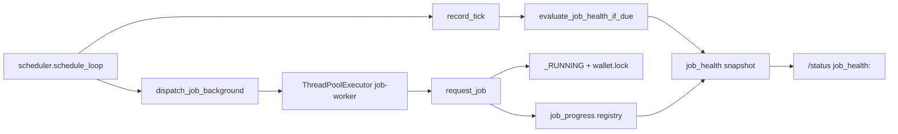

# Architecture Map — analizis

| Мета | Значение |
|------|----------|
| **KB версия** | v1.5 |
| **Статус документа** | draft |
| **Последнее обновление** | 2026-06-21 |

---

## Status

| Поле | Значение |
|------|----------|
| **Документ** | draft — G1 + G2 + G5 заполнены |
| **KB init** | project-aware (G1, G2, G5 closed) |
| **Prod runtime** | deploy + runtime inventory CONFIRMED из repo; live prod health — UNKNOWN |

---

## Purpose

Описывает архитектуру системы: контуры возможностей, entry points, runtime inventory, pipelines, интеграции и источники данных. Используется для Task, Impact Analysis, incident response и onboarding.

---

## Project Definition (G1)

| Поле | Значение | Источник | Статус |
|------|----------|----------|--------|
| **PROJECT_NAME** | analizis | `EXPERT_REVIEW.md` L1; env `TELEGRAM_CHAT_ID_ANALIZ` в `main.py` | CONFIRMED |
| **ONE_LINE_PURPOSE** | Автоматизация загрузки данных, аналитических расчётов и доставки результатов в Telegram на основе управляемых правил | `PROJECT_REFERENCE.md` § «Зачем этот проект» | CONFIRMED |
| **PRIMARY_ENTRYPOINT** | `scheduler.py` | `railway.toml` L7; `PROJECT_REFERENCE.md` § «Точка входа»; `scheduler.py` L280–281 | CONFIRMED |
| **DEPLOYMENT_TARGET** | Railway | `railway.toml`; `Procfile` L1 (comment) | CONFIRMED |
| **DEPLOY_CONFIG_FILE** | `railway.toml` (primary); `Procfile` (postinstall / Playwright deps) | repo root | CONFIRMED |
| **RUN_COMMAND** | `/opt/venv/bin/python scheduler.py` | `railway.toml` `[services.main] start` | CONFIRMED |

Deploy service name (Railway): `file-analyzer` — `railway.toml` L6.

---

## Runtime entrypoint (G2)

| Поле | Значение | Источник | Статус |
|------|----------|----------|--------|
| **Primary entrypoint** | `scheduler.py` → `main()` | `railway.toml` L7; `scheduler.py` L262–281 | CONFIRMED |
| **Deploy command** | `/opt/venv/bin/python scheduler.py` | `railway.toml` | CONFIRMED |
| **Startup path** | `main()` → build Telegram `Application` → register handlers → `ensure_worker_started()` (WalletEditor lazy workers) → `RULES.get_snapshot(force_sync=True)` → start daemon `schedule_loop` → `app.run_polling()` | `scheduler.py` L262–277 | CONFIRMED |
| **Scheduler loop** | `schedule_loop()`: каждые ~5s → `record_tick()` → `evaluate_job_health_if_due()` → schedules → `dispatch_job_background` (non-blocking) | `scheduler.py` | CONFIRMED |
| **Telegram** | long polling (`app.run_polling`); команды через `integrations/tg_commands.get_handlers()` | `scheduler.py` L266–277 | CONFIRMED |
| **Secondary entry** | `main.py` CLI (`python main.py <file>`) — не prod start; library entry `process_file()` вызывается из download job | `main.py` L157–174; `integrations/downloader.py` L18, L355 | CONFIRMED |

---

## Confirmed Facts

- **G1** закрыт TASK-2026-05-31-01; **G2** закрыт TASK-2026-05-31-02 (2026-05-31).
- Единственная точка привязки job → runnable: `JOB_REGISTRY` в `integrations/tg_commands.py` L132–138.
- Registered job types: `wallet`, `hourly`, `rate`, `download` — `core/lock_status.py` L16.
- Schedules загружаются из rules workbook через `core/schedules.load_schedules()` → `rules.xlsx` (via `core/rules_provider.py`).
- Job single-flight: PID lock `{STATE_DIR}/locks/{job_type}.lock` — `core/job_runner.py` L57–109.
- Download/analyze pipeline lock: `/tmp/dropbox_pipeline.lock` — `run_once_guard.py` L6.
- **Wallet Hang Patch A** — `downloader_wallets.py`: explicit Playwright timeouts + stage logs + `record_progress("wallet", stage)`.
- **Wallet Hang Patch B** — scheduled jobs via `dispatch_job_background` (no `future.result()` in `schedule_loop`); TG/manual still blocking via `dispatch_job_sync` / `dispatch_job_async`.
- **Job Health Guard C1** — observe-only: `core/job_progress.py` + `core/job_health.py` → `/status` `job_health:` block; recovery **off**.
- **WalletEditor Auto-Enable** — plan/execute from recalculated Dropbox registry; TG `/auto_enable_plan`, `/auto_enable_run`; Antares via profile worker batch queue; B2 registry patch.
- **WalletEditor HOLD enforcement** — runtime block on `add_partner` before Antares when card+partner on hold sheet.
- **WalletEditor Add Wallet** — separate Excel routing + engine (`add_wallet_contract`, `add_wallet_engine`); per-profile worker queue; no registry write.
- **Telegram token sanitization** — errors/logs redact bot token (E-SEC-01).

---

## Job execution & health (Wallet Hang Mitigation + JHG v2 C1)



| Layer | Module | Role | Patch |
|-------|--------|------|-------|
| Scheduler | `scheduler.py` | Tick + schedule gating; **does not wait** for job completion | **B** |
| Dispatch | `core/job_dispatch.py` | `dispatch_job_background` → `submit(request_job)` + done-callback log | **B** |
| Runner | `core/job_runner.py` | Lock acquire/release, `_RUNNING`, `job_*` events | — |
| Progress | `core/job_progress.py` | In-memory `(job_type → stage, ts)`; wallet stages from Patch A | **A** + **C1** |
| Health | `core/job_health.py` | Classify idle / running_ok / running_slow / stuck / ghost_lock; observe events | **C1** |
| Status | `integrations/tg_commands.py` | `format_job_health_lines()` in `/status` | **C1** |

**Future (planned, not implemented):** C2 ghost_lock recovery only; C3 flag-gated stuck release — see `tasks.md` JOB-HEALTH-GUARD-V2.

---

## Unknowns

| ID / поле | Описание |
|-----------|----------|
| Live prod health | Работает ли Railway deploy сейчас |
| Schedule rows in prod rules.xlsx | Конкретные cron/interval для каждого job_type |
| Raccoon integration | Упомянут в `EXPERT_REVIEW.md`, не найден в `.py` |
| `<LEGACY_DOC_OR_PLANNED_FEATURE>` | Прочие DOCS_ONLY фичи |

---

## Open Questions

- Какие schedule rows enabled в prod `rules.xlsx`?
- Есть ли staging/local deploy кроме Railway?
- Нужен ли отдельный pipeline для standalone Dropbox watcher?

---

## Назначение

**analizis** — автоматизация загрузки данных, аналитических расчётов и доставки результатов в Telegram на основе управляемых правил.

| ID | Контур | Job type | Статус |
|----|--------|----------|--------|
| R1 | Hourly analytics | `hourly` | CONFIRMED active |
| R2 | Wallet analytics | `wallet` | CONFIRMED active |
| R3 | Antares download + conversion/payout analysis | `download` | CONFIRMED active |
| R4 | Bakai rate monitor | `rate` | CONFIRMED active |
| R5 | Telegram control plane (commands, access, rules reload) | — | CONFIRMED active |
| R6 | WalletEditor (Telegram Excel → Antares card editing) | — | CONFIRMED active |

---

## Prod entry & deploy

| Поле | Значение | Статус |
|------|----------|--------|
| **Primary entrypoint** | `scheduler.py` | CONFIRMED |
| **Deploy target** | Railway | CONFIRMED |
| **Deploy config** | `railway.toml`; `Procfile` (postinstall) | CONFIRMED |
| **Run command** | `/opt/venv/bin/python scheduler.py` | CONFIRMED |
| **Deploy service name** | `file-analyzer` | CONFIRMED |

Ссылка: `decisions.md` **E1**, **E2**, **E4**, **E9**.

---

## Runtime inventory

Классификация по reachability из `scheduler.py` (direct import или `JOB_REGISTRY` chain).

### CONFIRMED_ACTIVE

| Модуль | Роль | Reachability |
|--------|------|--------------|
| `scheduler.py` | Prod entry: Telegram + schedule loop | deploy start |
| `integrations/tg_commands.py` | Commands, `JOB_REGISTRY`, job wrappers | `scheduler.py` L22, L268 |
| `core/job_runner.py` | Job dispatch, PID locks, event log | `scheduler.py`, `tg_commands` |
| `core/schedules.py` | Load schedules from rules | `scheduler.py` L177 |
| `core/rules_provider.py` | Sync/load `rules.xlsx` | startup + jobs |
| `core/rules_v2/*` | Rules snapshot, validation, accessors | rules chain |
| `core/config_manager.py` | job_params from rules | hourly gate, wallet params |
| `core/access_rules.py`, `core/access_guard.py` | Telegram access control | `tg_commands` |
| `core/state_store.py`, `core/state_provider.py` | Job state persistence | hourly, wallet wrappers |
| `core/event_log.py` | Append-only JSONL events | `job_runner`, analyzers |
| `core/scheduler_health.py`, `core/scheduler_clocks_control.py` | Scheduler observability / reset | `schedule_loop`, `/reload_rules` |
| `core/lock_status.py` | Lock inspection for `/status` | `tg_commands` |
| `integrations/downloader_wallets.py` | Job `wallet` | `JOB_REGISTRY` |
| `integrations/downloader.py` | Job `download` | `JOB_REGISTRY` |
| `integrations/bakai_monitor_playwright.py` | Job `rate` | `JOB_REGISTRY` |
| `integrations/hourly_downloader.py` | Antares download for hourly | `analyzers/hourly_report.py` |
| `integrations/dropbox_watcher.py` | Dropbox file IO | download, rules, `main.process_file` |
| `integrations/telegram_bot.py` | Async outbound sender queue + delivery health state | jobs, analyzers, `telegram_transport`, WalletEditor worker |
| `transport/telegram_transport.py` | Transport wrapper `send_text` | hourly/wallet wrappers |
| `main.py` | `process_file()` — payout analyze + conversion delegation | `downloader.run_download`, CLI |
| `integrations/conversion_pipeline.py` | Conversion lifecycle orchestrator (download, fp, run, move, observability) | `downloader.run_download`, `main.process_file` (conversion) |
| `integrations/conversion_fingerprint.py` | Passive conversion input fingerprint (conv/card/rules/special_cards) | `conversion_pipeline.py` |
| `observability/conversion_fp_observation.py` | Phase 1B diagnostic JSONL (full hashes, retention 14d) | hook from `conversion_pipeline.py` terminal paths |
| `integrations/conversion_wallet_editor_bridge.py` | Conversion `problem_cards` → Wallet Editor Excel + enqueue (best-effort) | `analyzers/conversion.py` `run()` after reports |
| `run_once_guard.py` | `/tmp/dropbox_pipeline.lock` | `main.py`, `downloader.py` |
| `analyzers/hourly_report.py` | Hourly pipeline orchestration | `run_hourly_job` |
| `analyzers/hourly_analyzer.py` | Hourly DTO | hourly chain |
| `analyzers/wallet_analyzer.py` | Wallet DTO | wallet chain |
| `analyzers/selector.py` | Route conversion/payout files → analyzer via code constants | `main.process_file` |
| `analyzers/conversion.py` | Conversion facade → `ConversionAnalyzer` + reporter | `conversion_pipeline`, CLI delegation |
| `analyzers/conversion_analyzer.py` | Conversion business logic | `analyzers/conversion.py` |
| `analyzers/conversion_dto.py` | Conversion DTO / result types | analyzer + reporter |
| `analyzers/payout.py` | Payout file analyzer | `main.process_file` |
| `reporters/hourly_reporter.py`, `reporters/wallet_reporter.py` | Render hourly/wallet reports | job chains |
| `reporters/conversion_reporter.py` | Render conversion Excel + Telegram | `analyzers/conversion.py` |
| `core/rules_v2/accessors.py` | `ConversionRulesAccessor` — rules snapshot access for conversion | conversion analyzer |
| `config/payout_config.yaml` | Payout analyzer config | `analyzers/payout.py` via `payout_config_loader.py` |
| `analyzers/raccoon_wallet_columns.py` | PayIn Excel column mapping constants (runtime source) | `raccoon_wallet_analyzer`, `raccoon_wallet_config_loader` |
| `analyzers/raccoon_wallet_config_loader.py` | Rules V2 config resolve (scalars + roster + groups) | `raccoon_wallet_analyzer`, `raccoon_wallet_downloader` |
| `core/rules_v2/raccoon_wallet_rules_accessor.py` | Rules V2 partner roster union + groups cfg | `raccoon_wallet_config_loader` |
| `analyzers/raccoon_wallet_analyzer.py` | Raccoon PayIn analysis + TG | `raccoon_wallet_downloader`, `raccoon_jobs` |
| `integrations/raccoon_wallet_downloader.py` | Raccoon Playwright PayIn download | job `raccoon_wallet` |
| `integrations/raccoon_jobs.py` | Raccoon job registry bindings | `JOB_REGISTRY` |
| `integrations/wallet_editor_tg.py` | WalletEditor: TG document ingest, allowlist, operator routing | `tg_commands` MessageHandler |
| `automation/worker.py` | Per-profile queues + daemon workers | `scheduler.ensure_worker_started`, `wallet_editor_tg` |
| `automation/engine.py` | WalletEditor Playwright business logic — disable flow (Antares UI) | `automation/worker` |
| `automation/add_wallet_contract.py` | Add Wallet Excel contract, routing, batch prep, result dataframe | `wallet_editor_tg`, `add_wallet_engine` |
| `automation/add_wallet_engine.py` | Add Wallet Playwright UI automation (create modal) | `automation/worker` `_run_add_wallet_task` |
| `automation/runtime.py` | `WalletEditorTask`, operator map, credentials, result naming, `run_id` | worker, handler |
| `integrations/wallet_editor_registry.py` | Dropbox registry append with retry/timeout/rev conflict | `wallet_editor_registry_async` (daemon) |
| `integrations/wallet_editor_registry_async.py` | Stage result copy + schedule async append | `automation/worker` after TG send |
| `integrations/wallet_editor_registry_settings.py` | `wallet_editor` job_params (`registry_*_seconds`) | `wallet_editor_registry` |
| `integrations/wallet_editor_registry_lifecycle.py` | Lifecycle recalc (`hold`, `Отлёжка`, re-enable dates/status) | `wallet_editor_registry` |
| `integrations/wallet_editor_registry_xlsx.py` | Format-preserving openpyxl read/write for registry sheets | `wallet_editor_registry` |
| `automation/audit.py` | WalletEditor logging/stats helpers | engine, worker |

### LEGACY (не production)

| Модуль | Почему | Риск |
|--------|--------|------|
| `automation/main.py` | Standalone WalletEditor entry (Platform_2.0 legacy) | Несовместим с WE-5 routing; не запускать параллельно со `scheduler.py` |
| `automation/tg_receiver.py` | Raw `getUpdates` polling (legacy) | Второй polling loop; сломан после `WalletEditorTask` API |

### DORMANT

| Модуль | Почему | Активация |
|--------|--------|-----------|
| `analyzers/transactions.py` | DORMANT; нет imports из active chain; stale ref to removed `analysis_map.yaml` | `decisions.md` + Impact |

### DEV_ONLY

| Модуль | Почему |
|--------|--------|
| `main.py` `__main__` CLI | `python main.py <file>` — не prod start |
| `integrations/downloader.py` `__main__` | Manual run block L388–396 |
| `integrations/downloader_wallets.py` `__main__` | L259–260 |
| `integrations/bakai_monitor_playwright.py` `__main__` | L213–214 |
| `scripts/*` | Manual test/extract scripts |
| `tools/validate_rules_xlsx.py` | CLI validator |
| `tests/*` | Test suite |

### DOCS_ONLY

| Item | Комментарий |
|------|-------------|
| Raccoon data source | `EXPERT_REVIEW.md` only; no `.py` references |
| `PROJECT_REFERENCE.md`, `EXPERT_REVIEW.md` | Legacy architecture docs |
| `project_memory/*` | KB / workflow, not runtime |

### UNKNOWN

| Item | Комментарий |
|------|-------------|
| Prod schedule configuration | Depends on live `rules.xlsx` content |

---

## Pipelines

### P1 — Hourly report

| | |
|---|---|
| **Trigger** | Schedule `job_type=hourly` (rules schedules + `job_params` gate) or TG `/run_hourly` | 
| **Entry** | `run_hourly_job()` → `analyzers/hourly_report.run_hourly_report()` | 
| **Input** | Antares payin/payout xlsx via Playwright (`integrations/hourly_downloader.py`) | 
| **Output** | Telegram `TELEGRAM_CHAT_ID_HOURLY`; state fp in `state_store` | 
| **Happy path** | download → fingerprint compare → skip if unchanged → DTO → render → send → commit fp | 
| **Failure path** | missing files → `job_skipped_missing_inputs`; exception → `job_failed` event + re-raise from `job_runner` | 
| **Статус** | CONFIRMED |

### P2 — Wallet report

| | |
|---|---|
| **Trigger** | Schedule `wallet` or TG `/run_wallet` | 
| **Entry** | `integrations/downloader_wallets.run_wallet_cycle()` | 
| **Input** | Antares wallet exports via Playwright | 
| **Output** | Telegram `TELEGRAM_CHAT_ID_WALLET`; state fp | 
| **Happy path** | download → fp compare → skip if unchanged → DTO → render → send → state_update | 
| **Failure path** | empty report → `RuntimeError`; no chat_id → warning, skip send; exception → `job_failed` | 
| **Статус** | CONFIRMED |

### P3 — Antares download + conversion/payout analyze

| | |
|---|---|
| **Trigger** | Schedule `download` or TG `/run_download` | 
| **Entry** | `integrations/downloader.run_download()` → `run_conversion_pipeline()` (conversion) + `main.process_file()` (payout) | 
| **Input** | Antares via Playwright; files uploaded to Dropbox | 
| **Output** | Telegram `TELEGRAM_CHAT_ID_ANALIZ`; conversion/payout reports | 
| **Happy path** | Playwright download → upload Dropbox → acquire `/tmp/dropbox_pipeline.lock` → conversion via `run_conversion_pipeline` (passive fingerprint → `conversion.run`) → payout via `process_file` if cd_/payout_ present → tiered final TG → release lock | 
| **Failure path** | download error → TG notify + raise; lock busy → skip analyze; conversion failure → partial final TG; payout may still run; analyze error → TG notify (no raise from downloader on conversion-only failure) | 
| **Observability** | `conversion_*` events + `jobs.conversion` state; passive fingerprint compare (no dedup skip) | 
| **Статус** | CONFIRMED |

**Conversion path (modernized):**

```
Before:
  download → process_file → selector → conversion.run

After (production):
  downloader → run_conversion_pipeline → conversion.run

CLI / legacy entry:
  main.process_file(conversion) → run_conversion_pipeline → conversion.run
```

**Conversion stack (layered):**

| Layer | Module | Role |
|-------|--------|------|
| Orchestrator | `integrations/conversion_pipeline.py` | Download, aux move, passive fingerprint, observability, processed move |
| Fingerprint | `integrations/conversion_fingerprint.py` | SHA256(conv + card + rules snapshot fp + special_cards) — passive only (Phase 1A) |
| Observation | `observability/conversion_fp_observation.py` | Diagnostic JSONL — full hashes, changed_components, would_skip (Phase 1B pre-skip; flag default off) |
| Facade | `analyzers/conversion.py` | `run()` entry |
| Analyzer | `analyzers/conversion_analyzer.py` | Business logic |
| DTO | `analyzers/conversion_dto.py` | Typed inputs/outputs |
| Reporter | `reporters/conversion_reporter.py` | Excel + Telegram render |
| Rules access | `core/rules_v2/accessors.py` | `ConversionRulesAccessor` |

Routing: conversion and payout use explicit constants in `analyzers/selector.py` (`CONVERSION_FILE_PATTERN`, `PAYOUT_FILE_PATTERN`). No YAML routing config (E-CONFIG-03).

### P4 — Bakai rate monitor

| | |
|---|---|
| **Trigger** | Schedule `rate` or TG `/run_rate` | 
| **Entry** | `integrations/bakai_monitor_playwright.run_rate_monitor_safe()` | 
| **Input** | `bakai.kg` via Playwright | 
| **Output** | Telegram `CURRENT_RATE_BAKAI_CHAT_ID` / `NEW_RATE_BAKAI_CHAT_ID` | 
| **Happy path** | scrape rate → compare with `/tmp/bakai_last_buy_rate.txt` → notify on change | 
| **Failure path** | outside 08:00–23:55 MSK → skip; 3 retries then TG alert + optional screenshot | 
| **Статус** | CONFIRMED |

### P5 — Dropbox file analyze (sub-pipeline)

| | |
|---|---|
| **Trigger** | Called from P3 (payout) or standalone CLI `python main.py <file>` | 
| **Entry** | `main.process_file(filename, aux_filename?)` — conversion files delegate to `run_conversion_pipeline()` | 
| **Input** | Dropbox paths via `DROPBOX_INPUT_PATH`; analyzer routing via `selector.py` code constants | 
| **Output** | Telegram via analyzer modules; file moved to processed | 
| **Happy path (conversion)** | `process_file` detects conversion → `run_conversion_pipeline` → passive fingerprint → `conversion.run` → move to processed | 
| **Happy path (payout)** | download from Dropbox → selector → `payout.run` → move to processed | 
| **Failure path** | no analyzer → warning TG; download/move/analyze errors → TG + return False | 
| **Статус** | CONFIRMED (library path); CLI entry — DEV_ONLY |

### Conversion Runtime Lifecycle

Passive fingerprint Phase 1A — compute and compare only; **always** runs analysis.

```
downloader
    ↓
run_conversion_pipeline
    ↓
fingerprint compare (passive — log/state/event only)
    ↓
conversion.run
    ↓
ConversionAnalyzer
    ↓
ConversionReporter (Excel + Telegram)
    ↓
event_log (conversion_started / conversion_fingerprint_computed / conversion_success|failed|skipped)
    ↓
state_store (jobs.conversion — last_status, last_fingerprint, last_fingerprint_match, …)
```

**Fingerprint inputs:** SHA256(conversion file) + SHA256(card file) + `rules_snapshot_fingerprint` + special_cards hash (or stable `"missing"`).

**Feature flag:** `CONVERSION_FINGERPRINT_ENABLED` (default on). Dedup skip — Phase 1B dedup (not implemented).

**Observation (Phase 1B diagnostic):** `{STATE_DIR}/observability/conversion_fp_observation_YYYY-MM-DD.jsonl` — full hashes, `changed_components`, `would_skip`; flag `CONVERSION_FP_OBSERVATION_ENABLED` (default off); 14-day retention; best-effort.

**CLI delegation:** `main.process_file` with conversion analyzer → same `run_conversion_pipeline` path as downloader.

### Conversion → Wallet Editor hook (P3 sub-path)

Best-effort bridge after conversion analysis completes in `analyzers/conversion.py` `run()`.

```
ConversionAnalyzer.analyze()
    ↓
problem_cards (DataFrame)
    ↓
analyzers/conversion.py run() — after conversion reports / TG
    ↓
integrations/conversion_wallet_editor_bridge.py
    ↓ filter valid rows (card + original_partner)
    ↓ all valid rows (no per-run cap)
    ↓ build Excel (card, action=remove_partner, value=original_partner)
    ↓ info message → CONVERSION_WALLET_EDITOR chat
    ↓
WalletEditorTask (profile CONVERSION_AUTO, direct login/password env)
    ↓
automation/worker.py add_task → engine.run → result xlsx → Telegram
```

**Constraints:** hook never raises; missing env → skip; does not use `WALLET_EDITOR_OPERATOR_MAP`; `ConversionAnalyzer.analyze()` unchanged.

### P-WE — WalletEditor (Telegram Excel ingest → Antares card editing)

| | |
|---|---|
| **Trigger** | Telegram document (`.xlsx`) от mapped operator в allowed chat |
| **Entry** | `integrations/wallet_editor_tg.handle_wallet_editor_document` |
| **Production path** | `scheduler.py` → PTB `app.run_polling()` → `integrations/tg_commands.py` MessageHandler |
| **Input** | `.xlsx` из Telegram; operator credentials из env map |
| **Routing** | `detect_excel_routing()`: disable = `card`+`action`+`value`; Add Wallet = `card`+`phone` (no `action`/`value`); ambiguous → reject |
| **Output** | Result `.xlsx` в Telegram (`send_document`); summary text |

**Pipeline (production):**

```
Telegram document (.xlsx)
        ↓
PTB polling (основной runtime — scheduler.py)
        ↓
integrations/wallet_editor_tg.py
        ↓
chat allowlist (WALLET_EDITOR_ALLOWED_CHAT_IDS)
        ↓
operator routing (WALLET_EDITOR_OPERATOR_MAP → profile credentials)
        ↓
detect_excel_routing()
        ├─ disable (card+action+value) → WalletEditorTask → automation/engine.py
        └─ add_wallet (card+phone)     → WalletEditorAddWalletTask → add_wallet_engine.run()
        ↓
profile queue (per operator_profile)
        ↓
profile worker (daemon thread per profile)
        ↓
[disable] automation/engine.py  OR  [add_wallet] automation/add_wallet_engine.py
        ↓
result xlsx (wallet_editor_result_* / add_wallet result naming)
        ↓
Telegram summary + document reply
        ↓
[disable only] Dropbox registry append async (DROPBOX_WALLET_EDITOR_PATH, best-effort)
        ↓
[optional] Auto-Enable: eligibility → batches → Antares enable → patch Включено/Комментарий включения
```

**Add Wallet pipeline (Phase 1 / 1.1 / 2 — complete):**

```
Telegram .xlsx (card + phone required)
        ↓
prepare_add_wallet_batch() — normalize columns/aliases; validate rows
        ↓
per row: pre-search duplicate (card_exists_strict) → open «Добавление кошелька» modal
        ↓
fill_add_wallet_form() — required Карта/Телефон; status default Тест; optional fields only if Excel non-empty
        ↓
[if aggregate column] select_single_aggregate_checkbox → nested aggregate fields (Phase 1.1)
        ↓
Phase 2 optional fields (text/textarea/select/radio/KYC in lower form)
        ↓
save → wait modal close OR validation error
        ↓
post-save strict card search (row_matches_card_strict) — modal close alone ≠ success
        ↓
result xlsx + Telegram batch summary ([WalletEditorAdd] log prefix)
        ↓
no Dropbox registry write (Add Wallet v1)
```

**Auto-Enable pipeline (Phase A → B2):**

```
Dropbox registry download → recalculate_all_results
        ↓
build_auto_enable_plan (eligibility, dedup, max_rows_per_run, batch split)
        ↓
/auto_enable_plan → plan report only (TG route wallet_editor_auto_enable)
        ↓
/auto_enable_run → fresh plan → [dry_run=0] enqueue_auto_enable_batch per batch
        ↓
automation/worker.py WalletEditorAutoEnableBatchTask → execute_enable_batch
        ↓
HOLD check (wallet_editor_hold) → open_card → add_partner/set_status → save
        ↓
patch_enable_results_in_dropbox_registry (Включено, Комментарий включения)
        ↓
batch report + optional batch xlsx to TG route
```

**Registry write (UX-A):** `save_registry_workbook` → `_sync_all_results_sheet` / `_sync_runs_sheet` copy template row styles for new data rows; value-only updates on existing rows.

**HOLD enforcement:** manual `engine.run` pre-pass; auto-enable executor before `open_card`; fail-closed if hold sheet unreadable.

**Архитектурные ограничения:**

| Правило | Детали |
|---------|--------|
| Один polling loop | Production = `scheduler.py` + python-telegram-bot; **нет** raw `getUpdates` |
| Legacy path | `automation/main.py`, `automation/tg_receiver.py` — **не** production |
| Fail-closed | Пустой allowlist / unmapped user_id / incomplete profile credentials → отказ без download |
| Per-operator isolation | Отдельные credentials, auth-state, queue, worker на `operator_profile` |
| Sequential per profile | Задачи одного профиля — последовательно; разные профили — параллельно |

**Happy path (disable):** allowlist OK → operator mapped → download to `/tmp/wallet_editor/` → `add_task(WalletEditorTask)` → profile worker → `engine.run()` → result file → TG summary + document → async registry append.

**Happy path (Add Wallet):** allowlist OK → operator mapped → routing=ADD_WALLET → `add_add_wallet_task(WalletEditorAddWalletTask)` → `add_wallet_engine.run()` → result file → TG summary + document; **no** registry append.

**Failure path:** chat denied / non-xlsx / unmapped user / incomplete credentials → reply с отказом, `get_file` не вызывается; engine error → TG error text; Add Wallet row failures captured in result xlsx with per-row `result` code.

**Outbound health (Option B):** jobs/workers use `telegram_bot` queue; health-state tracks enqueue vs delivery; `scheduler.schedule_loop` emits periodic `[TelegramSender/health]` logs. Error paths sanitize bot token (E-SEC-01).

**Статус** | CONFIRMED |

См. `decisions.md` **E-WE-01 … E-WE-19**, **E-SEC-01**.

---

### P-RW — Raccoon Wallet (PayIn monitor)

| | |
|---|---|
| **Trigger** | Schedule `raccoon_wallet` or TG `/run_raccoon` |
| **Entry** | `integrations/raccoon_jobs.run_raccoon_wallet_job()` → `run_raccoon_wallet_cycle()` |
| **Config path** | `raccoon_wallet_config_loader.resolve_raccoon_wallet_config()` — **Rules V2 only** (`rules.xlsx`) |
| **Config hierarchy** | Raccoon Wallet → Rules V2 → `job_params` · `thresholds_partner` · `wallet_limits` · `partner_groups` (+ columns: code constants) |
| **Input** | Raccoon PayIn export via Playwright → `/tmp/raccoon_wallet/payin_*.xlsx` |
| **Output** | Telegram `TELEGRAM_CHAT_ID_RACCOON_WALLET` |
| **Статус** | CONFIRMED |

```
Raccoon Wallet (job / analyzer / downloader)
  ↓
Rules V2 (rules.xlsx)
  ↓
job_params · thresholds_partner · wallet_limits · partner_groups
  (+ PayIn columns: code constants)

raccoon_wallet_downloader
  → resolve_raccoon_wallet_config
  → Playwright download (payin_days_back from job_params)
  → raccoon_wallet_analyzer.analyze_raccoon_wallets
       → overlay thresholds_partner / wallet_limits
       → exclude_time from rules
       → TG report
```

---

## Background / scheduled work

| Job / loop | Trigger | Function | Lock / single-flight | Side effects | Failure behavior | Статус |
|------------|---------|----------|----------------------|--------------|------------------|--------|
| `schedule_loop` | daemon thread, ~5s tick | `scheduler.schedule_loop` | n/a | `dispatch_job_background` for due jobs; `record_tick` + `evaluate_job_health_if_due` each iteration | load fail → sleep 10s; job errors logged in worker callback | CONFIRMED |
| `wallet` | rules schedule or TG | `run_wallet_cycle` | `{STATE_DIR}/locks/wallet.lock` | Antares DL (bounded PW timeouts), progress stages, payout datepicker `data-date` navigation, TG wallet chat, state | timeout → exception → `job_failed`; lock released in `finally` | CONFIRMED |
| `hourly` | rules schedule (+ job_params gate) or TG | `run_hourly_job` | `{STATE_DIR}/locks/hourly.lock` | Antares DL, TG hourly chat, state | skip events; exception → `job_failed` | CONFIRMED |
| `download` | rules schedule or TG | `run_download` | job lock + `/tmp/dropbox_pipeline.lock` | Antares DL, Dropbox, analyze, TG analiz chat | TG notify + raise | CONFIRMED |
| `rate` | rules schedule or TG | `run_rate_monitor_safe` | `{STATE_DIR}/locks/rate.lock` | Playwright scrape, TG rate chats | 3 retries; final TG alert | CONFIRMED |
| `raccoon_wallet` | rules schedule or TG | `run_raccoon_wallet_cycle` | `{STATE_DIR}/locks/raccoon_wallet.lock` | Raccoon PayIn DL, analyzer, TG | exception → `job_failed` | CONFIRMED |

Hourly gating: `intraday_interval_minutes`, `final_daily_time` from rules job_params — `scheduler.py` L120–148.

---

## Integrations & subsystems

Только integrations, reachable из active runtime.

| ID | Интеграция | Назначение | Модули | Статус |
|----|------------|------------|--------|--------|
| I1 | Telegram | Control plane + notifications + WalletEditor ingest | `scheduler.py`, `tg_commands`, `telegram_bot`, `telegram_transport`, `wallet_editor_tg` | CONFIRMED |
| I2 | Antares (Playwright) | Data download + WalletEditor card editing | `downloader.py`, `hourly_downloader.py`, `downloader_wallets.py`, `automation/engine.py` | CONFIRMED |
| I3 | Dropbox | Rules sync, file IO, processed moves | `dropbox_watcher.py`, `rules_provider.py`, `main.py` | CONFIRMED |
| I4 | Bakai (Playwright) | RUB buy rate | `bakai_monitor_playwright.py` | CONFIRMED |
| I5 | rules.xlsx (Excel) | Schedules, access, job_params, rules engine | `rules_provider.py`, `access_rules.py`, `schedules.py` | CONFIRMED |
| I6 | Filesystem | `/tmp`, `/data/state` (STATE_DIR), locks, caches | `job_runner`, `event_log`, `run_once_guard` | CONFIRMED |
| I7 | Raccoon | Data source (documented) | — | DOCS_ONLY |

Database: not present in active runtime chain.

---

## Источники истины (data)

Полный inventory: **`contracts.md`** §1–§8 (G5, TASK-2026-05-31-03).

| Данные | Источник | Потребители | Критичность | Статус |
|--------|----------|-------------|-------------|--------|
| `rules.xlsx` | Dropbox `RULES_XLSX_PATH` → `/tmp/rules_cache/rules.xlsx` | schedules, access, job_params, analyzers | CRITICAL | CONFIRMED |
| `rules.xlsx` → `telegram_routes` (optional) | same workbook | Phase 2 shadow; Phase 3A–3D: hourly, wallet, conversion WE, Bakai rate routes when `TELEGRAM_ROUTES_FROM_RULES_V2=1` | OPTIONAL | CONFIRMED |
| `config/payout_config.yaml` | repo `config/` | `payout.py` via `payout_config_loader.py` | IMPORTANT | CONFIRMED |
| `state.json` | Dropbox `{rules_folder}/state/state.json` | hourly/wallet fingerprints | IMPORTANT | CONFIRMED |
| Event log | `{STATE_DIR}/events/events_*.jsonl` | observability | OPTIONAL | CONFIRMED |
| Antares xlsx exports | Playwright → `/tmp/*` | hourly, wallet, download | IMPORTANT | CONFIRMED |
| `special_cards.xlsx` | Dropbox optional | `conversion.py` / fingerprint | OPTIONAL | CONFIRMED |
| Conversion fingerprint | conv + card bytes + rules snapshot + special_cards | `conversion_fingerprint.py`; state `jobs.conversion.last_fingerprint` | OPTIONAL (Phase 1A passive) | CONFIRMED |

---

## Reading hints

- Task / Impact: **Pipelines** + **Runtime inventory** + **Background / scheduled work**
- Incident: pipeline § failure path + `contracts.md` env/locks
- Prod snapshot: `current_state.md`

---

## История

| Дата | Событие |
|------|---------|
| 2026-05-31 | Документ создан из `architecture_map_template.md` |
| 2026-05-31 | G1 — TASK-2026-05-31-01 |
| 2026-05-31 | G2 Runtime Architecture — TASK-2026-05-31-02 |
| 2026-05-31 | G5 Data Contracts cross-ref — TASK-2026-05-31-03 |
| 2026-06-01 | **P-WE WalletEditor** — integrated WE-0…WE-6; production via `scheduler.py` |
| 2026-06-02 | **Conversion Modernization** — layered analyzer/reporter/DTO; `run_conversion_pipeline` orchestrator; observability + passive fingerprint Phase 1A + Phase 1B observation JSONL |
| 2026-06-02 | **Conversion → Wallet Editor hook** — `conversion_wallet_editor_bridge.py`; best-effort; max 10 cards/run |
| 2026-06-03 | **Wallet Editor Dropbox registry** — `wallet_editor_registry.py`; `DROPBOX_WALLET_EDITOR_PATH`; E-WE-07 |
| 2026-06-03 | **Registry lifecycle** — `hold`, `Отлёжка`, re-enable calc; E-WE-08 |
| 2026-06-03 | **Registry format-safe** — openpyxl in-place; rev conflict; E-WE-09 |
| 2026-06-03 | **Registry async + timeout** — job_params; TG before registry; E-WE-10 |
| 2026-06-04 | **Wallet hang mitigation** — Patch A (PW timeouts + stage logs); Patch B (`dispatch_job_background`); Job Health Guard C1 (observe-only `/status` `job_health:`) |
| 2026-06-07 | **WalletEditor Auto-Enable** (Phase A/B1/B2); **HOLD enforcement**; **registry UX-A** formatting; token sanitization; wallet datepicker fix |
| 2026-06-21 | **WalletEditor Add Wallet** — Excel routing fork; `add_wallet_contract` + `add_wallet_engine`; Phase 1/1.1/2 complete; KYC scoped checkbox; E-WE-16…E-WE-19 |
